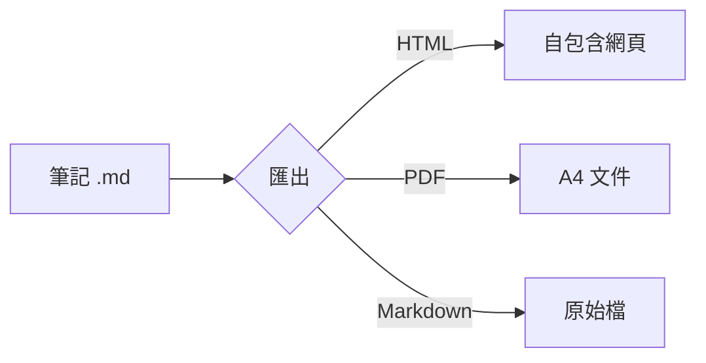

# 匯出說明

MyObsidian 提供單篇與整個 Vault 兩種匯出方式,方便離線閱讀與分享。

## 1. 單篇筆記匯出(HTML / PDF / Markdown)

在側邊欄筆記上按 **右鍵**,可選擇三種格式:

- **⬇ 匯出成 HTML**:轉成一個完全獨立的 .html 檔
  - CSS 樣式全部內嵌,不需要網路
  - 本地圖片會轉成 base64 內嵌,單檔即可分享
  - 自動支援淺色 / 深色主題(跟隨系統)
- **⬇ 匯出成 PDF**:以淺色排版輸出 A4 PDF,適合列印與正式分享
- **⬇ 匯出成 Markdown**:複製原始 .md 檔到指定位置

> `mermaid` 程式碼區塊(流程圖等)會先渲染成向量圖再匯出:HTML 內嵌 SVG 圖片、PDF 會把整張圖縮放到單頁內完整呈現。

工具列的「⬇ 匯出 HTML」等同於對目前開啟的筆記做 HTML 匯出。

## 2. 整個 Vault 匯出成網站

「⬇ 匯出 Vault」會把所有筆記轉成一個靜態 HTML 網站:

1. 保留資料夾結構,每篇 `.md` 變成 `.html`
2. `[[雙向連結]]` 與 `[其他筆記](../歡迎.md)` 都會自動改寫成對應的 `.html`
3. 圖片等附件會一併複製
4. 自動產生 `index.html` 筆記總覽頁

匯出後用瀏覽器打開 `index.html` 就能離線瀏覽整個知識庫,例如回到 [[歡迎]] 或 [[功能介紹]]。
